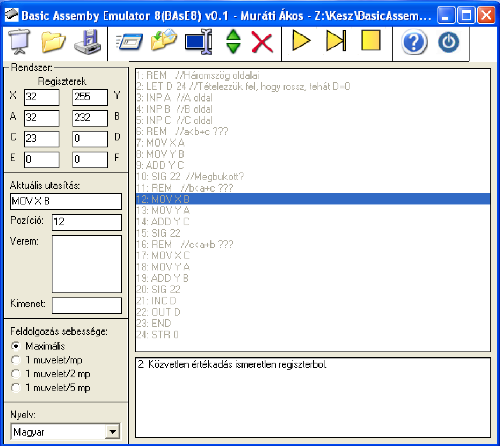

# BAsE8 - 8-bit Basic Assembly Emulator
> This is an archive project, unmaintained since 2003.

A Basic Assembly Emulator (BAsE) is an educational software
to teach 8-bit assembly language principals showing visualising register changes and operations step-by-step or in slow-execution mode in Hungarian or in English.



## Project folder structure
 - `asm` - Assembly code-samples for demonstartion purposes
 - `design` - Image and source assets
 - `nyelvek` - Language resource files
 - `setup` - Nullsoft Install System installer project

For binary compilations, dependency and setup files, check releases.

## Installation
Download the latest release and execute the installer. Alternatively you can register the required dependencies manually too and execute the `base8.exe`

```bash
# Registering legacy Windows Common Dialogue component
regsvr32.exe -i comdlg32.ocx

# Execute teh binary and load a
base8.exe
```

## Development Requirements
 - Visual Studio 6
    - Visual Basic 6.0 language support
 - Nullsoft Install System


